# 关键项目岗位需求管理系统需求文档

## 文档概述

### 文档信息
- **文档标题**: 关键项目岗位需求管理系统需求文档
- **文档版本**: v1.0
- **创建日期**: 2025年1月
- **文档类型**: 产品需求文档(PRD)
- **目标读者**: 开发人员、测试人员、项目管理人员

### 项目背景
本项目是一个专注于岗位需求需求管理的系统，旨在为企业提供完整的人员需求申请、审批、跟踪和统计功能。系统采用前后端分离的Web应用架构，提供直观的用户界面和完善的业务流程管理。

---

## 1. 系统总体架构

### 1.1 技术架构
- **前端技术栈**: Vue.js 2.x + Element UI + Tailwind CSS
- **数据存储**: 浏览器LocalStorage（当前版本）
- **架构模式**: 单页应用(SPA)
- **部署方式**: 静态文件部署

### 1.2 系统目标
- 提供标准化的人员需求申请流程
- 实现多级审批工作流管理
- 支持项目信息的统一管理和统计
- 提供直观的数据分析和展示功能

### 1.3 系统架构图

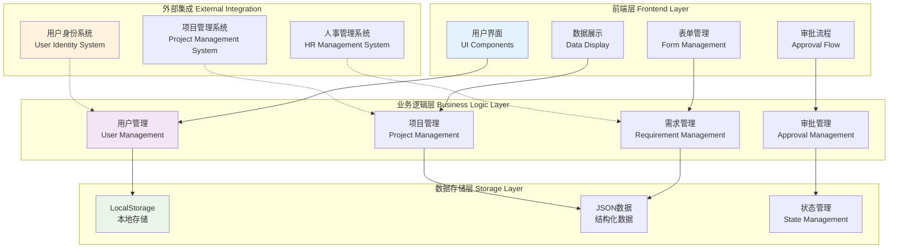

---

## 2. 核心业务功能模块

### 2.1 用户管理模块

#### 2.1.1 用户身份识别
- **功能描述**: 系统支持多种用户身份识别方式
- **实现方式**: URL参数 > 本地存储 > 默认用户
- **用户标识**: 通过用户名进行身份识别，如"张明华"
- **权限控制**: 基于用户身份的审批权限控制

#### 2.1.2 角色权限管理
- **申请者角色**: 可创建和提交人员需求申请
- **审批者角色**: 可审批特定专业或板块的需求申请
- **管理员角色**: 可查看所有数据并进行统计分析

### 2.2 人员需求管理模块

#### 2.2.1 需求申请功能

**核心功能特性**:
- **需求创建**: 用户可创建新的人员需求申请
- **项目关联**: 支持从现有项目中选择或搜索项目信息
- **岗位详情**: 详细描述岗位要求、职责、工作条件等
- **专业分类**: 支持多级专业分类（大类/二级专业）
- **需求编号**: 系统自动生成唯一需求编号

**表单字段要求**:

**基础信息字段**:
- `requirementId`: 需求编号（系统自动生成，格式：项目编码-部门编码-四位流水号）
- `applicant`: 申请人（自动获取）
- `applicationTime`: 申请时间（自动记录）
- `projectNumber`: 项目号（必填，下拉选择）
- `projectName`: 项目名称（自动带出）
- `projectManager`: 项目经理（自动带出）
- `department`: 管理归属（自动带出）

**岗位需求字段**:
- `discipline`: 专业分类（必填，支持级联选择）
- `requirementType`: 需求类型（设计类、PMC、EPC、咨询类）
- `jobTitle`: 职位/岗位名称（必填）
- `coreResponsibilities`: 岗位核心职责（必填，多行文本）
- `workLocation`: 工作地点（必填）
- `requiredOnboardDate`: 要求到岗时间（必填，日期选择）
- `positionCycle`: 岗位周期（选填）
- `quantity`: 需求人数（必填，默认为1）

**人员要求字段**:
- `gender`: 性别要求（男/女/不限）
- `ageRequirement`: 年龄要求（年龄区间）
- `titleRequirement`: 职称要求（初级/中级/高级/正高级）
- `professionalCertificates`: 专业资格证书（多选，支持自定义）
- `experienceRequirement`: 经验要求（文本描述）
- `educationRequirement`: 教育背景（文本描述）
- `languageRequirement`: 语言能力（文本描述）
- `otherRequirements`: 其他要求（文本描述）

#### 2.2.2 需求状态管理

**状态类型**:
- **待审批**: 刚提交的需求，等待审批
- **进行中**: 正在审批流程中的需求
- **匹配中**: 审批完成后，系统正在匹配人员资源
- **已关闭**: 需求被驳回或已完成

**状态流转规则**:
1. 新需求提交 → 待审批
2. 审批通过 → 进行中 → 匹配中
3. 审批驳回 → 已关闭
4. 资源匹配完成 → 系统自动关闭

### 2.3 专业分类体系

#### 2.3.1 专业大类结构
系统支持以下专业分类体系：

**施工类**:
- 管理、综合、吊装、调度、总图、土建、静设备、动设备、管道、电气、仪表、防腐保温、完工、其他

**质量类**:
- 管理、综合、体系、焊接&无损检测、检试验、其他

**安全类**:
- 管理、综合、培训、脚手架、临电、起重吊装、作业许可、机具、无损检测、其他

**控制类**:
- 管理、综合、费控、计划、文控、档案、合同、其他

**设计类**:
- 工艺、热工、环保、静设备、机械、粉体、工业炉、概算、技术经济、管道设计、管道应力、管道材料、给排水消防、建筑、结构、暖通、总图、电气、电信、仪表

**职能类**:
- 项目行政、项目助理、项目秘书、翻译、IT

**造价类**:
- 安装、土建、电仪

**管理类**:
- 项目经理、项目工程师、项目主任

**采购类**:
- 采购、采买、催交、检验、物流、仓储、材控

#### 2.3.2 专业分类体系结构图

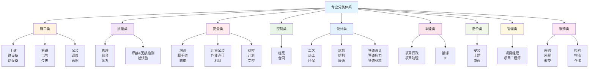

### 2.4 项目管理模块

#### 2.4.1 项目信息管理
- **项目数据库**: 维护项目基础信息库
- **项目信息带出**: 选择项目后自动带出项目名称、项目经理、管理归属等信息
- **项目类型支持**: 前期项目、合同项目、部门项目

#### 2.4.2 项目统计功能
- **需求统计**: 按项目统计人员需求数量和状态
- **专业分布**: 统计各专业需求分布情况
- **进度跟踪**: 跟踪各项目人员需求审批进度

---

## 3. 审批流程管理

### 3.1 审批流程设计

#### 3.1.1 标准审批流程
审批流程采用多级审批模式，每个需求包含两级审批：

**第一级：板块总监审批**
- 审批人：根据管理归属（department）确定的板块总监
- 审批权限：板块级别的整体审批

**第二级：专业审批人审批**
- 审批人：根据需求专业（discipline）确定的专业负责人
- 审批权限：专业领域的技术审批

#### 3.1.2 审批流程数据结构
```javascript
approvalFlow: {
    currentStep: 1,           // 当前审批步骤
    totalSteps: 2,           // 总审批步骤数
    steps: [                 // 审批步骤数组
        {
            step: 1,
            name: '板块总监审批',
            status: 'pending',      // pending/approved/rejected/terminated
            approver: '张明华',
            approvalTime: null,
            comment: null
        },
        {
            step: 2,
            name: '专业审批人审批',
            status: 'pending',
            approver: '李工程师',
            approvalTime: null,
            comment: null
        }
    ]
}
```

#### 3.1.3 审批流程架构图

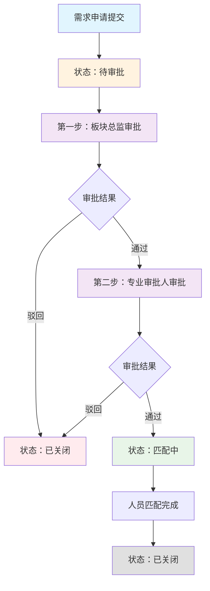

### 3.2 审批操作

#### 3.2.1 审批权限判断
- **当前用户匹配**: 系统判断当前用户是否为当前步骤的审批人
- **待我审批标识**: 待当前用户审批的需求会特殊标注
- **批量审批**: 支持一次审批多个需求（未来功能）

#### 3.2.2 审批操作流程
1. **查看需求详情**: 审批人查看完整的需求信息
2. **填写审批意见**: 必填的审批意见（文本框）
3. **选择审批结果**: 通过/驳回
4. **自动流转**: 系统自动处理下一步审批或完成流程

#### 3.2.3 审批状态管理
- **pending**: 待审批状态
- **approved**: 已通过
- **rejected**: 已驳回
- **terminated**: 已终止（因前置步骤驳回而终止）

### 3.3 审批权限控制

#### 3.3.1 用户权限体系
- **申请权限**: 所有用户都可创建需求申请
- **审批权限**: 仅指定审批人可处理对应步骤
- **查看权限**: 所有用户可查看公共信息，敏感信息需权限控制

#### 3.3.2 权限验证机制
- **URL参数验证**: 通过URL参数传递用户身份
- **本地存储验证**: 通过localStorage维护用户会话
- **默认用户兜底**: 提供默认用户身份保障系统可用性

#### 3.3.3 权限控制流程图

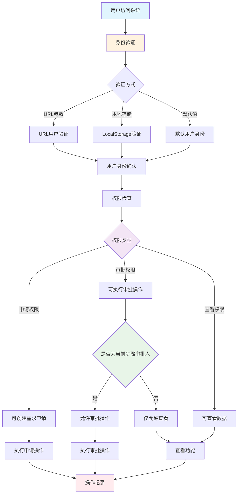

---

## 4. 数据管理与统计

### 4.1 数据存储方案

#### 4.1.1 数据存储方式
- **主存储**: 浏览器LocalStorage
- **数据格式**: JSON格式存储
- **数据持久化**: 页面刷新后数据保持有效
- **数据清理**: 支持手动清理过期数据

#### 4.1.2 数据结构设计
```javascript
// 主要数据模型
{
    selectedProject: {
        payload: {
            projectNumber: "项目号",
            projectName: "项目名称",
            projectManager: "项目经理",
            department: "管理归属",
            positions: [需求数组]
        }
    }
}
```

#### 4.1.3 数据结构关系图

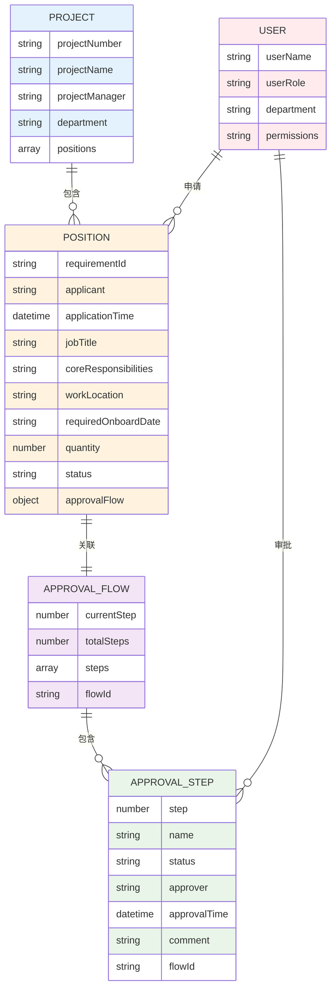

### 4.2 统计分析功能

#### 4.2.1 项目级统计
- **需求总数**: 统计项目内所有人员需求数量
- **进行中需求**: 统计正在审批流程中的需求数量
- **已关闭需求**: 统计已完成或已驳回的需求数量
- **待审批需求**: 统计待当前用户审批的需求数量

#### 4.2.2 专业维度统计
- **专业分布**: 按专业统计需求分布情况
- **专业需求数量**: 各专业的需求总量统计
- **专业审批进度**: 各专业的审批进度跟踪

#### 4.2.3 数据展示功能
- **数据看板**: 提供直观的数据统计看板
- **趋势分析**: 展示需求申请和审批的趋势
- **报表导出**: 支持Excel等格式的数据导出（未来功能）

#### 4.2.4 数据分析流程图

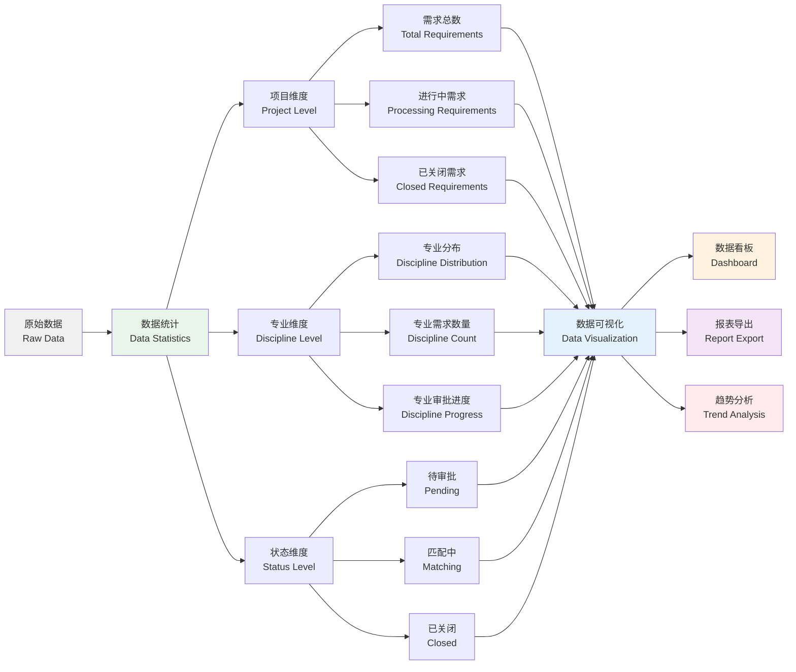

### 4.3 搜索与筛选

#### 4.3.1 多维度筛选
- **项目筛选**: 按项目号、项目名称筛选
- **专业筛选**: 按专业分类筛选
- **状态筛选**: 按审批状态筛选
- **时间筛选**: 按申请时间筛选

#### 4.3.2 搜索功能
- **全文搜索**: 支持项目号、项目名称、专业、岗位名称的全文搜索
- **复合搜索**: 支持多条件的组合搜索
- **智能推荐**: 搜索建议和自动完成

---

## 5. 用户界面设计

### 5.1 界面布局设计

#### 5.1.1 主要页面布局
- **顶部导航栏**: 系统标题和用户信息
- **标签页布局**: 主要功能模块通过标签页切换
- **卡片式布局**: 采用卡片式设计展示项目信息
- **响应式设计**: 支持不同屏幕尺寸的自适应

#### 5.1.2 交互设计原则
- **直观操作**: 提供清晰的操作流程和按钮位置
- **状态反馈**: 及时的操作反馈和状态提示
- **数据展示**: 合理的信息密度和视觉层次

### 5.2 关键界面模块

#### 5.2.1 需求创建界面
- **表单设计**: 采用分组表单设计，逻辑清晰
- **字段验证**: 实时表单验证和错误提示
- **权限控制**: 根据用户权限显示/隐藏特定功能

#### 5.2.2 项目需求详情界面
- **分屏设计**: 左侧需求列表，右侧详情展示
- **导航锚点**: 支持详情页面的锚点导航
- **审批操作**: 集成审批操作的专用区域

#### 5.2.3 审批流程界面
- **流程图展示**: 可视化的审批流程展示
- **状态标识**: 清晰的审批状态和进度标识
- **操作提示**: 明确的操作提示和权限说明

#### 5.2.4 界面交互流程图

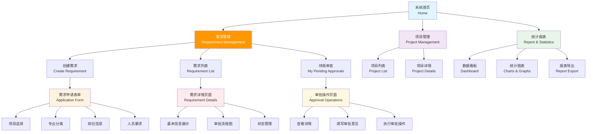

---

## 6. 业务流程规范

### 6.1 需求申请流程

#### 6.1.1 标准申请流程
1. **项目选择**: 从项目列表中选择或搜索目标项目
2. **填写基本信息**: 填写项目相关的基础信息
3. **专业选择**: 选择需求的专业分类
4. **岗位详情**: 详细填写岗位要求和职责描述
5. **人员要求**: 填写具体的人员资格要求
6. **需求提交**: 提交申请并启动审批流程

#### 6.1.3 需求申请详细流程图

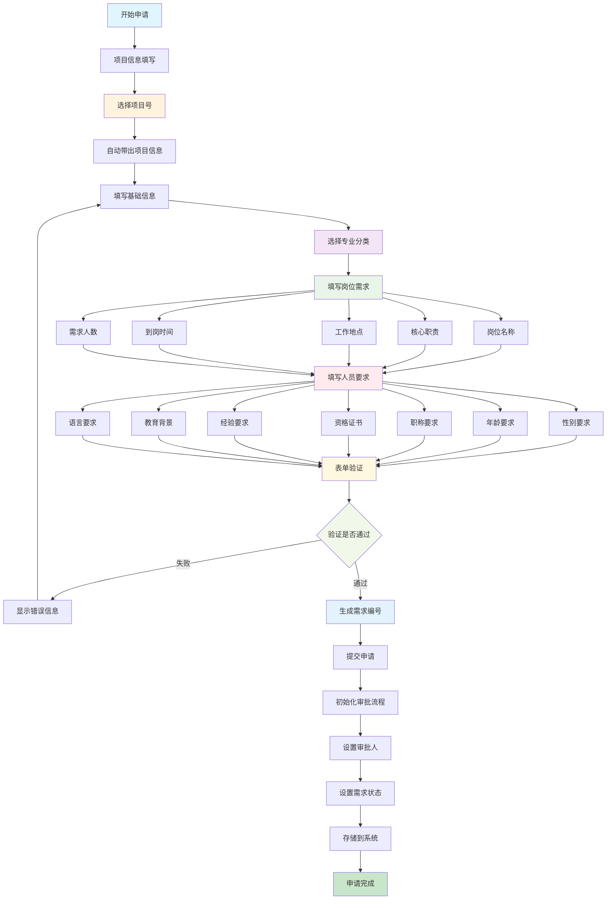

#### 6.1.2 数据验证规则
- **必填字段**: 项目号、专业、岗位名称、核心职责等必填
- **格式验证**: 日期格式、数字范围等格式验证
- **业务规则**: 自定义的业务逻辑验证规则

### 6.2 审批业务流程

#### 6.2.1 标准审批流程
1. **待审批状态**: 新提交的需求进入待审批状态
2. **第一级审批**: 板块总监审批，可批准或驳回
3. **第二级审批**: 专业审批人审批，可批准或驳回
4. **流程完成**: 审批通过后进入匹配状态
5. **流程终止**: 任何一级驳回则整体需求关闭

#### 6.2.2 审批操作规范
- **审批权限**: 仅有指定用户可执行审批操作
- **审批意见**: 审批操作必须填写审批意见
- **操作记录**: 系统自动记录所有审批操作和操作时间
- **状态同步**: 审批状态变更实时更新到所有相关界面

### 6.3 数据管理流程

#### 6.3.1 数据创建流程
1. **表单填写**: 通过标准化表单收集数据
2. **数据验证**: 前端和后端双重数据验证
3. **数据存储**: 数据持久化存储到本地存储
4. **状态初始化**: 初始化审批流程和数据状态

#### 6.3.2 数据更新流程
1. **状态变更**: 通过审批操作变更需求状态
2. **数据同步**: 确保所有相关数据的同步更新
3. **版本控制**: 维护数据的版本历史（未来功能）

---

## 7. 系统集成与扩展

### 7.1 数据接口设计

#### 7.1.1 内部数据接口
- **项目数据接口**: 项目信息的读写接口
- **需求数据接口**: 人员需求数据的CRUD接口
- **审批数据接口**: 审批流程数据的读写接口

#### 7.1.2 外部集成接口
- **用户身份系统**: 与外部用户管理系统的集成接口（规划中）
- **项目管理系统**: 与项目信息管理系统的数据同步接口（规划中）
- **人事管理系统**: 与人员信息管理系统的集成接口（规划中）

### 7.2 性能优化策略

#### 7.2.1 前端性能优化
- **数据缓存**: 合理的数据缓存策略减少重复请求
- **懒加载**: 大数据的懒加载和分页加载
- **压缩优化**: 静态资源的压缩和合并

#### 7.2.2 用户体验优化
- **加载提示**: 数据加载过程的友好提示
- **操作反馈**: 及时的操作成功/失败反馈
- **错误处理**: 完善的错误处理和用户提示

---

## 8. 未来功能规划

### 8.1 短期功能规划

#### 8.1.1 数据管理增强
- **数据导入/导出**: 支持Excel等格式的数据批量导入导出
- **数据备份**: 自动数据备份和恢复功能
- **数据清理**: 定期清理过期和冗余数据

#### 8.1.2 用户管理增强
- **多用户管理**: 支持多用户并发访问和操作
- **权限细化**: 更细粒度的权限控制
- **操作审计**: 用户操作的完整审计日志

### 8.2 长期功能规划

#### 8.2.1 系统架构升级
- **服务端架构**: 从静态页面升级到服务端渲染架构
- **数据库集成**: 集成专业的数据库管理系统
- **微服务架构**: 采用微服务架构提高系统可扩展性

#### 8.2.2 移动端支持
- **移动应用**: 开发移动端应用支持移动办公
- **推送通知**: 审批提醒等推送通知功能
- **离线支持**: 离线数据操作和同步功能

#### 8.2.3 智能分析功能
- **数据分析**: 深度数据分析和趋势预测
- **智能推荐**: 基于历史数据的智能推荐系统
- **自动化审批**: 规则化的自动化审批流程

---

## 9. 技术实现要点

### 9.1 前端技术实现

#### 9.1.1 框架选择
- **Vue.js 2.x**: 成熟的前端框架，组件化开发
- **Element UI**: 企业级UI组件库，提供丰富的组件
- **Tailwind CSS**: 原子化CSS框架，快速样式开发

#### 9.1.2 核心功能实现
- **组件化开发**: 可复用的组件设计
- **状态管理**: Vuex进行应用状态管理（未来考虑）
- **路由管理**: 单页应用的路由管理

### 9.2 数据流转设计

#### 9.2.1 数据存储策略
- **LocalStorage**: 浏览器本地存储，简单可靠
- **JSON格式**: 结构化数据存储格式
- **数据版本**: 数据版本管理确保兼容性

#### 9.2.2 状态管理设计
- **Vue实例状态**: 使用Vue的data和computed管理应用状态
- **组件通信**: 父子组件间的事件传递
- **数据同步**: 多组件间的数据同步机制

---

## 10. 验收标准

### 10.1 功能验收标准

#### 10.1.1 核心功能验收
- **需求创建**: 能够正常创建和提交人员需求申请
- **审批流程**: 审批流程能够正常流转和状态更新
- **数据统计**: 统计功能数据准确，展示正确
- **搜索筛选**: 搜索和筛选功能工作正常

#### 10.1.2 用户体验验收
- **界面响应**: 界面响应速度和操作流畅度
- **错误处理**: 异常情况的友好提示和处理
- **数据完整性**: 数据的一致性和完整性保证

### 10.2 性能验收标准

#### 10.2.1 响应时间要求
- **页面加载**: 首屏加载时间不超过3秒
- **操作执行**: 一般操作响应时间不超过1秒
- **数据查询**: 数据查询和统计响应时间不超过2秒

#### 10.2.2 兼容性要求
- **浏览器兼容**: 支持主流现代浏览器（Chrome、Firefox、Safari、Edge）
- **屏幕适配**: 支持不同分辨率屏幕的正常显示
- **操作系统**: 支持Windows、Mac、Linux等主流操作系统

---

## 附录

### A. 专业分类完整列表
[详细专业分类结构已在第2.3节中描述]

### B. 审批流程状态图

#### B.1 需求状态流转图

以下用流程图表示需求状态流转（与 stateDiagram 等价，便于在各类 Markdown 预览中正确显示中文）。

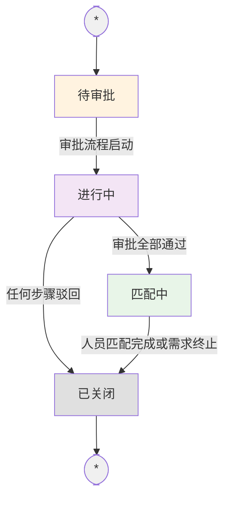

| 状态 | 说明 |
|------|------|
| **待审批** | 需求刚提交，等待审批 |
| **进行中** | 板块总监、专业审批人审批中 |
| **匹配中** | 审批完成，按增员方式分发至 HR/生态平台进行人员匹配与推荐 |
| **已关闭** | 需求已完成、被驳回或匹配后关闭 |

#### B.2 审批步骤状态图

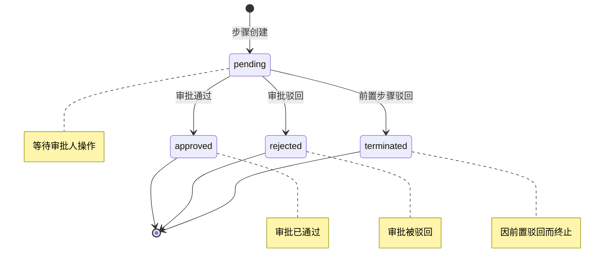

### C. 数据模型定义
[详细数据结构已在各相关章节中描述]

### D. 系统交互时序图

#### D.1 需求审批完整时序

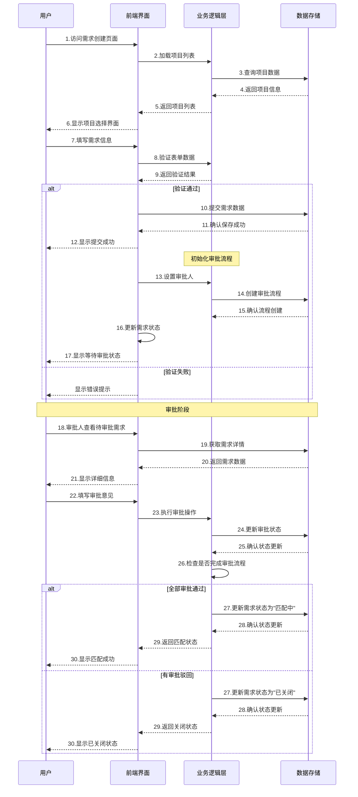

#### D.2 数据统计查询时序

```mermaid
sequenceDiagram
    participant U as 用户
    participant UI as 前端界面
    participant BL as 业务逻辑层
    participant DS as 数据存储
    
    U->>UI: 1.访问统计页面
    UI->>BL: 2.请求统计数据
    BL->>DS: 3.查询所有需求数据
    DS-->>BL: 4.返回原始数据
    
    BL->>BL: 5.计算项目级统计
    
    par 并行计算
        BL->>BL: 6.计算需求总数
        BL->>BL: 7.计算进行中需求数
        BL->>BL: 8.计算已关闭需求数
    
    par 并行计算
        BL->>BL: 9.计算专业分布
        BL->>BL: 10.计算状态分布
        BL->>BL: 11.计算待审批数量
    end
    
    BL->>BL: 12.汇总统计数据
    BL-->>UI: 13.返回统计结果
    UI->>UI: 14.渲染图表展示
    UI-->>U: 15.显示数据看板
```

### E. 界面原型规范
[界面设计要求已在第5章中详细说明]

---

*本需求文档将根据项目进展和用户反馈持续更新和完善。*
