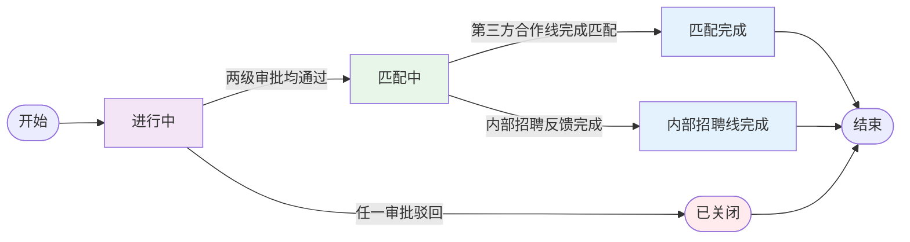
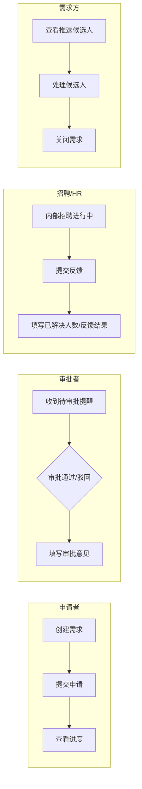

# 岗位需求流程图（面向使用者）

## 一、整体流程图

```mermaid
flowchart LR
    subgraph 创建阶段["1. 创建需求"]
        direction TB
        A[进入人员需求] --> B[选择管理归属]
        B --> C[选择是否派遣到指定项目]
        C --> D[选择需求类型与项目号]
        D --> E[添加岗位（新增/批量导入）]
        E --> F[填写岗位详情]
        F --> G[提交申请]
    end

    subgraph 审批阶段["2. 审批流程"]
        direction TB
        H[状态：进行中] --> I[板块总监审批]
        I --> J{审批结果}
        J -->|通过| K[专业审批人审批]
        J -->|驳回| L[已关闭]
        K --> M{审批结果}
        M -->|通过| N[状态：匹配中]
        M -->|驳回| L
    end

    subgraph 匹配阶段["3. 人员匹配"]
        direction TB
        O{增员方式}
        O -->|内部招聘| P[内部招聘进行中]
        O -->|第三方| Q[人员匹配进行中]
        O -->|内部招聘| P
        O -->|第三方| Q
        P --> R[HR 提交反馈]
        R --> T[内部招聘线完成]
        Q --> U[合作方推送候选人]
        U --> V[需求方处理候选人]
        V --> W[匹配完成]
    end

    G --> H
    N --> O

    style A fill:#e3f2fd
    style G fill:#fff3e0
    style H fill:#f3e5f5
    style N fill:#e8f5e9
    style L fill:#ffebee
```

---

## 二、状态流转简图

---

## 三、角色操作流程图

---

## 四、使用说明

### 1. 适用对象

本系统面向以下使用者：

| 角色 | 说明 | 主要操作 |
|------|------|----------|
| 申请者 | 项目负责人或项目经理，需为项目申请人员 | 创建需求、提交申请、查看进度、手动关闭需求 |
| 审批者 | 板块总监、专业审批人 | 审批需求（通过/驳回） |
| 招聘/HR | 人力资源部门 | 处理内部招聘、提交反馈 |
| 需求方 | 用人部门负责人 | 查看候选人、处理人选 |

---

### 2. 创建需求（申请者）

**步骤顺序**：

1. 点击「创建人员需求」进入表单
2. **项目信息**：依次选择
   - 需求类型（设计类 / PMC / EPC / 咨询类）
   - 管理归属
   - 是否派遣到指定项目（否：项目号自动带出部门号；是：可自由选择项目号）
   - 项目号（选择后自动带出项目名称、项目经理）
3. **岗位列表**：
   - 点击「新增岗位」逐个添加
   - 或点击「批量导入」按模板批量添加
4. **岗位详情**：选中左侧岗位后，在右侧填写
   - 增员方式：内部招聘 / 第三方合作（可多选）
   - 职位名称、核心职责、数量、工作地点、到岗时间等
   - 专业、年龄、职称、学历等要求
5. 填写完成后点击「保存」提交申请

**注意事项**：

- 管理归属必须先选，否则无法选择项目号
- 至少选择一种增员方式
- 岗位名称、核心职责为必填项

---

### 3. 审批需求（审批者）

**操作入口**：

- 在项目列表或需求详情中，标有「待我审批」的需求表示需要您处理
- 进入需求详情页，在「需求状态管理」区域查看审批流程
- 若当前步骤的审批人为您，会显示「审批操作」区域

**操作步骤**：

1. 查看岗位要求、项目信息
2. 在「审批意见」框中填写意见（可选）
3. 点击「通过」或「驳回」完成审批

**结果说明**：

- 通过：进入下一步审批；若为最后一步，则需求进入「匹配中」
- 驳回：需求直接变为「已关闭」，流程终止

---

### 4. 内部招聘反馈（招聘/HR）

**适用条件**：需求选择了「内部招聘」且两级审批均已通过

**操作步骤**：

1. 在需求详情中进入「内部招聘反馈」区域
2. 填写「已解决人数」
3. 填写「反馈结果」（如：已招满、部分到岗等）
4. 点击「提交反馈」

**结果说明**：

- 提交后内部招聘线完成，需求进入可关闭状态
- 若同时选择第三方合作：第三方合作线继续推进
- 需求不会自动关闭，需由发起人手动关闭

---

### 5. 处理候选人（需求方）

**适用条件**：需求选择了「第三方合作」且合作方已推送候选人

**操作步骤**：

1. 在需求详情中进入「企业推送人员」区域
2. 查看候选人列表及留言
3. 对每位候选人进行选择（录用/不录用等）
4. 完成人选确认后，需求状态变为「匹配完成」
5. 需求进入可关闭状态，由发起人手动关闭

---

### 6. 状态说明

| 状态 | 含义 | 您可能需要做的 |
|------|------|----------------|
| 进行中 | 审批流程中 | 若为审批人：进行审批 |
| 匹配中 | 审批已通过，正在匹配人员 | 等待内部招聘反馈或候选人推送；若有候选人：处理人选 |
| 匹配完成 | 第三方合作线已完成匹配 | 发起人可随时手动关闭需求 |
| 内部招聘线完成 | 内部招聘反馈已提交 | 发起人可随时手动关闭需求 |
| 已关闭 | 需求已结束 | 无需操作（审批驳回自动关闭，或发起人手动关闭） |

---

### 7. 快捷提示

- **待我审批**：红色标签，表示需要您审批
- **待我处理**：橙色标签，表示匹配中且有候选人待您处理
- **隐藏已关闭需求**：勾选后可过滤已关闭的需求，便于聚焦进行中的工作
- **搜索**：支持按需求 ID、岗位名称搜索

---

### 8. 常见问题

**Q：项目号选不到？**  
A：请先选择管理归属，再选择是否派遣到指定项目。选「否」时项目号由系统自动带出。

**Q：审批后需求去哪了？**  
A：驳回的需求会变为「已关闭」，可在列表中勾选「隐藏已关闭需求」查看进行中的需求。

**Q：内部招聘和第三方合作可以同时选吗？**  
A：可以。两条线并行进行，互不影响。

**Q：如何批量添加岗位？**  
A：点击「批量导入」，下载模板填写后上传。模板包含岗位名称、专业、数量等字段。

**Q：需求何时会关闭？**  
A：审批驳回时自动关闭。其他情况下，发起人可随时手动关闭需求。
